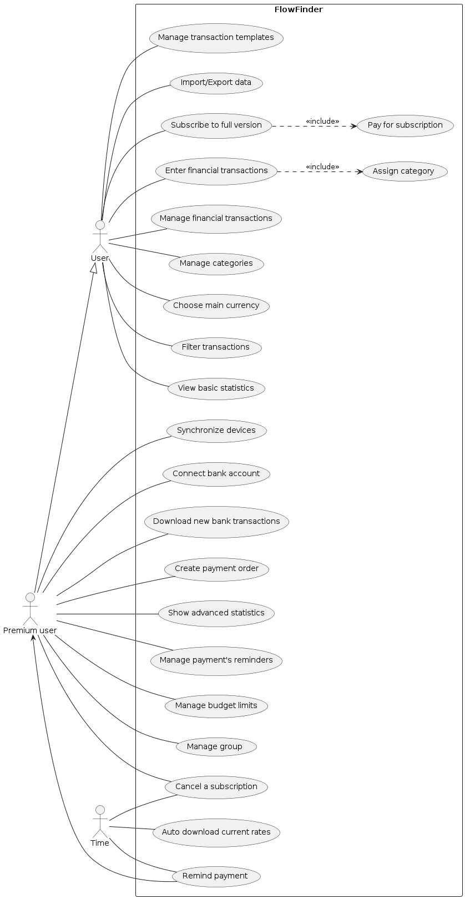
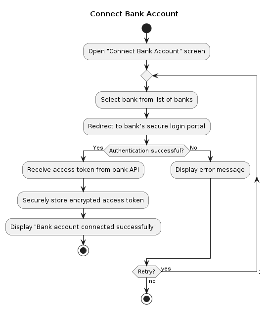
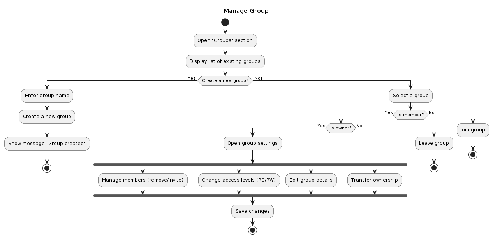
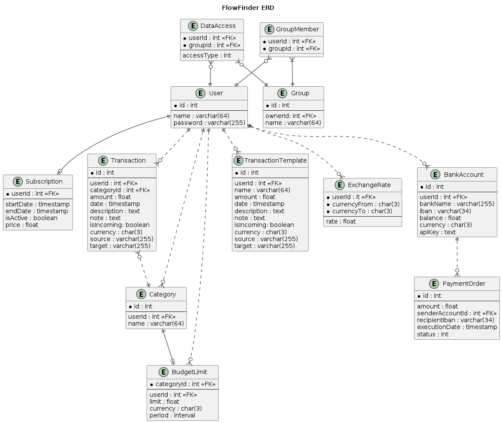
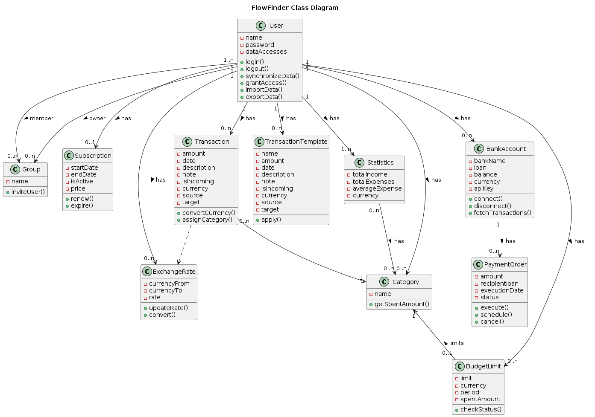
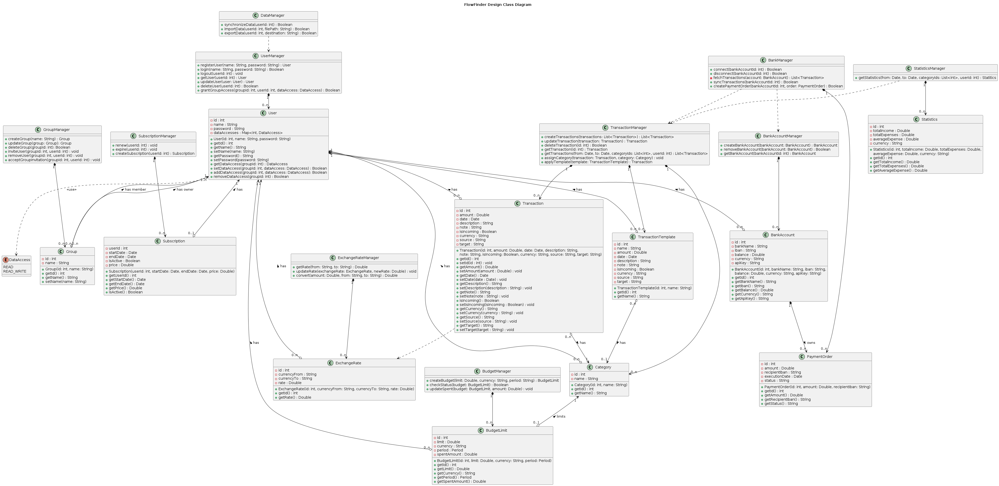
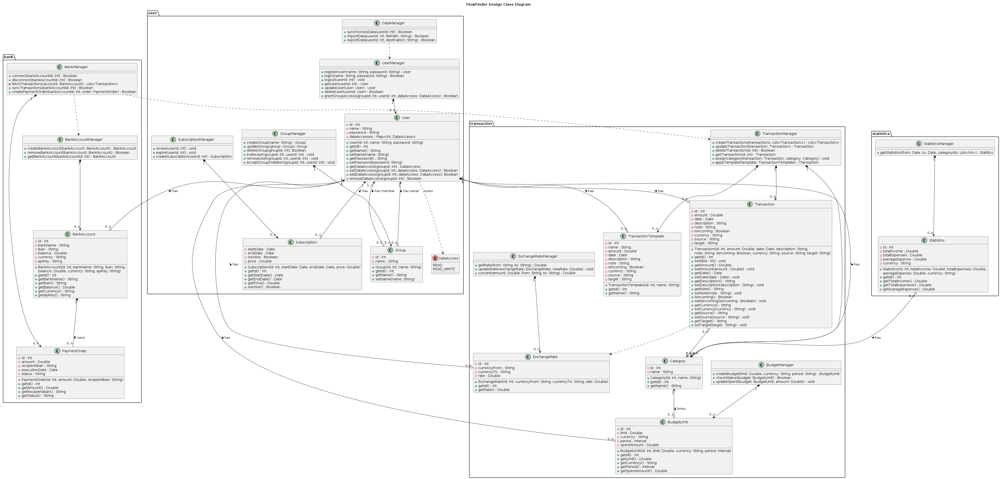
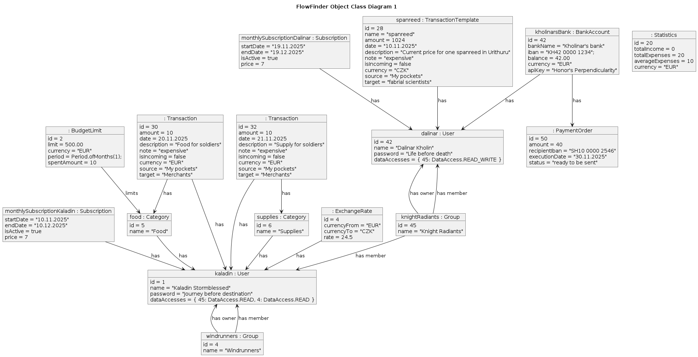
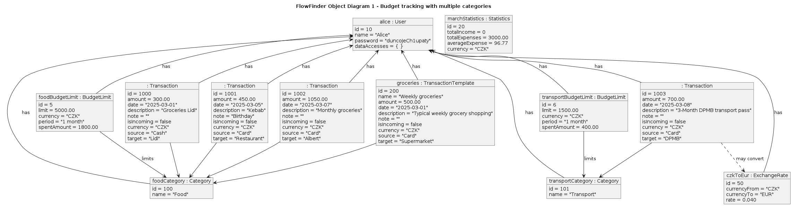

# FlowFinder — System Analysis & Design

**Course:** PB007 Software Engineering I  
**University:** Masaryk University, Faculty of Informatics  
**Period:** Autumn 2025 (semester project)  
**Type:** Fictional startup — requirements & UML modeling

> Personal finance application for tracking transactions, budgets, and premium features such as bank sync and shared group budgeting.

---

## Overview

**FlowFinder** is a fictional mobile-first personal finance app. Users can record income and expenses without registration (basic mode). Premium subscribers get bank connectivity, multi-device sync, budget limits, advanced statistics, payment reminders, and shared budgeting groups.

This repository documents the **analysis and design phase**: business requirements, use cases, and UML models produced over one semester as part of PB007.

---

## Team

| Member | Role |
|--------|------|
| Matej Bumbera | Team member — shared analysis & design deliverables |
| Peter Šišan | Team member — shared analysis & design deliverables |
| Oleksii Kim | Team member — shared analysis & design deliverables |

We worked in a team of 3 with equal weekly task split, peer review, and sync discussions when models conflicted.

---

## Deliverables

| Artifact | File |
|----------|------|
| Functional & non-functional requirements | [`requirements.md`](requirements.md) |
| Use case catalog (22 use cases) | [`textual-specification.md`](textual-specification.md) |
| Use case diagram | [`use-case.puml`](use-case.puml) |
| Activity diagrams | [`01_a_d_UC12.puml`](01_a_d_UC12.puml), [`02_a_d_UC21.puml`](02_a_d_UC21.puml) |
| Sequence diagrams | [`01_s_d_UC1.puml`](01_s_d_UC1.puml), [`02_s_d_UC21.puml`](02_s_d_UC21.puml), [`03_s_d_UC6.puml`](03_s_d_UC6.puml) |
| Analysis class diagram | [`analytic_class_diagram.puml`](analytic_class_diagram.puml) |
| Design class diagram | [`design_class_diagram.puml`](design_class_diagram.puml) |
| ERD | [`erd.puml`](erd.puml) |
| Package diagram | [`package_diagram.puml`](package_diagram.puml) |
| Object diagrams | [`object_diagram_1.puml`](object_diagram_1.puml), [`object_diagram_2.puml`](object_diagram_2.puml) |
| Detailed UC specs | [`01_t_s_UC1.md`](01_t_s_UC1.md), [`02_t_s_UC10.md`](02_t_s_UC10.md), [`03_t_s_UC3.md`](03_t_s_UC3.md) |
| Exported diagrams (PNG) | [`diagrams/`](diagrams/) |

---

## Key diagrams

### Use case diagram

### Activity — Connect bank account (UC12)

### Activity — Manage group (UC21)

### Entity-relationship diagram

### Analysis class diagram

### Design class diagram

### Package diagram

### Object diagrams

---

## Use case overview

| ID | Use case | Mode |
|----|----------|------|
| UC1 | Enter financial transactions | Basic |
| UC2 | Manage financial transactions | Basic |
| UC3 | Assign category | Basic |
| UC4 | Manage categories | Basic |
| UC5 | Choose main currency | Basic |
| UC6 | Filter transactions | Basic |
| UC7 | View basic statistics | Basic |
| UC8 | Manage transaction templates | Basic |
| UC9 | Import / Export data | Basic |
| UC10 | Subscribe to full version | Basic |
| UC11 | Synchronize devices | Premium |
| UC12 | Connect bank account | Premium |
| UC13 | Download new bank transactions | Premium |
| UC14 | Create payment order | Premium |
| UC15 | Show advanced statistics | Premium |
| UC16 | Cancel a subscription | Premium |
| UC17 | Manage payment reminders | Premium |
| UC18 | Remind payment | Premium |
| UC19 | Manage budget limits | Premium |
| UC20 | Auto-download current rates | System |
| UC21 | Manage group | Premium |
| UC22 | Pay for subscription | Basic |

---

## My contribution (Oleksii Kim)

Equal split across the team. Examples of deliverables I worked on:

- Use case diagram — actors, use cases, include/extend relationships
- Textual use case specifications (e.g. UC1, UC2)
- Activity diagram (UC1), sequence diagram (UC6)
- Package diagram and object diagram
- Iterative diagram fixes across weekly milestones

---

## Skills demonstrated

Requirements engineering · Use case modeling · UML (activity, sequence, class, object, package) · ERD · Analysis → design progression · Team collaboration · PlantUML · Git

---

## Viewing PlantUML diagrams

Open `.puml` files in VS Code with the PlantUML extension, or paste contents into [plantuml.com](https://www.plantuml.com/plantuml/uml).

---

## Note

Originally developed on university GitLab as PB007 coursework. Archived here for portfolio purposes after graduation.
